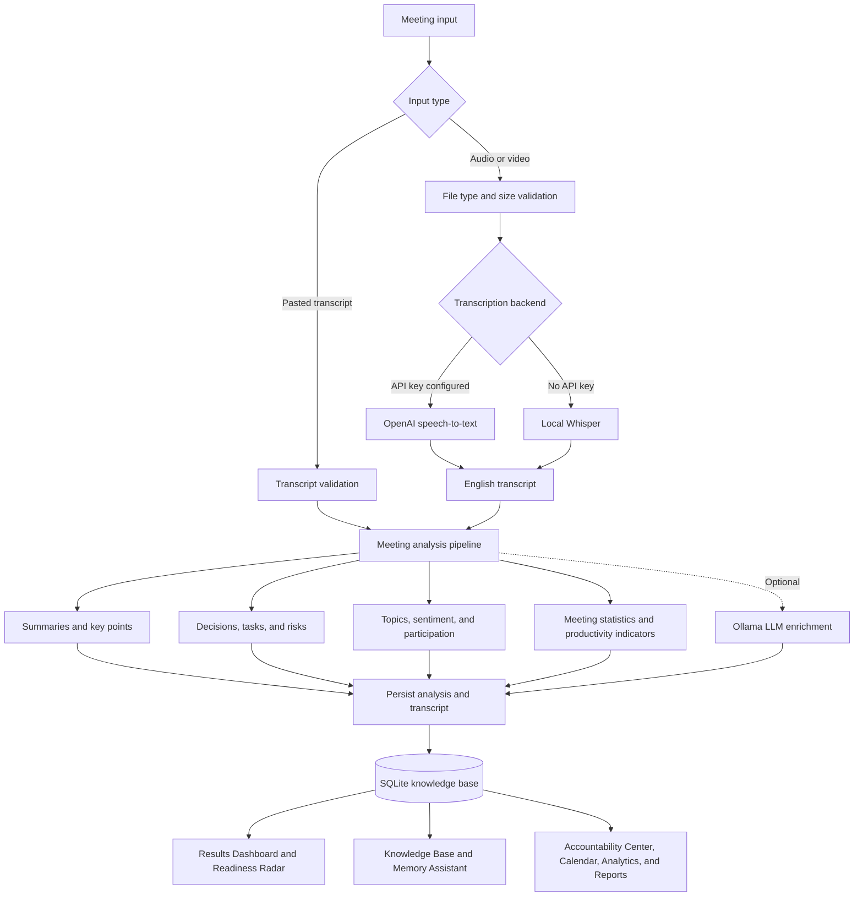
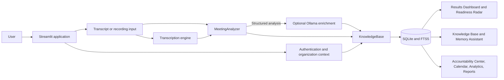

# MeetMind — AI-Powered Meeting Summarizer

MeetMind turns meeting transcripts and recordings into searchable, structured meeting records. It is designed for teams in organizations, colleges, and project groups that need to understand what was discussed, what was decided, what could block progress, and what should happen next.

The current application is the Streamlit app in `Phase_2_Audio_Video/`. It supports English-language meeting analysis, optional audio/video transcription, persistent meeting history, and cross-meeting productivity tools. `Phase_1_Text_Based/` contains the earlier text-based project phase.

## Contents

- [Features](#features)
- [Project flow](#project-flow)
- [Architecture](#architecture)
- [Technology stack](#technology-stack)
- [Getting started](#getting-started)
- [Configuration](#configuration)
- [Using MeetMind](#using-meetmind)
- [Project structure](#project-structure)
- [Testing](#testing)
- [Privacy and limitations](#privacy-and-limitations)

## Features

### Meeting analysis

- Analyze a pasted transcript or upload an audio/video recording.
- Create short and detailed summaries, key points, detected decisions, action items, risks, and topics.
- Extract task details such as assignee, deadline, and priority when they are present in the conversation.
- Review participant/speaker information, sentiment, transcript statistics, and a productivity score.
- Process long transcripts in chunks and aggregate the analysis.
- Keep analysis and generated summaries in English; the app does not offer translation or multilingual output.

### Meeting Readiness & Dependency Radar

The Results Dashboard includes a readiness indicator that surfaces high/critical risks, blocker or dependency language, and task-load pressure. It highlights risk items that may prevent a decision, deadline, or commitment from moving forward.

The readiness score is a transparent heuristic based on detected analysis signals; it is a triage aid, not a guarantee that a project or meeting is ready.

### Follow-through and organizational memory

- **Accountability Center:** track task owners, due dates, status, and overdue follow-ups across meetings.
- **Calendar:** create reminders and export events as an iCalendar (`.ics`) file.
- **Knowledge Base:** save meeting records in SQLite and search transcripts, summaries, decisions, and tasks using full-text search.
- **Memory Assistant:** retrieve relevant past meeting context and show the meetings used as sources for an answer.
- **Quality Coach:** receive practical recommendations based on meeting analysis, including participation balance and risk follow-through.
- **Analytics Dashboard:** explore trends in productivity, topics, participants, tasks, decisions, risks, and meeting durations.
- **Reports:** generate shareable meeting reports, including Markdown, HTML, and email-style formats.

### Workspace and presentation

- Local sign-in and organization membership for the prototype workspace.
- Premium dark dashboard with KPI cards and Plotly visualizations.
- English-only application workflow and English Whisper model by default.

## Project flow

The following diagram shows the normal path from meeting input to follow-up:



## Architecture



### Main processing stages

1. The Streamlit interface accepts a transcript or an audio/video file.
2. Uploaded files are checked against supported extensions and the configured size limit.
3. Recordings are transcribed with OpenAI when an API key is configured; otherwise, the local Whisper backend is used. Long recordings can be split into chronological chunks.
4. The NLP engine analyzes the transcript and builds summaries and structured meeting signals.
5. Ollama can optionally enrich the results when enabled and available.
6. The transcript and analysis are saved to the local SQLite knowledge base.
7. Dashboard pages use the saved analysis for meeting review, readiness triage, recall, accountability, analytics, and reporting.

## Technology stack

| Area | Technologies | Purpose |
|---|---|---|
| Language and runtime | Python 3.10+ | Application and processing logic |
| User interface | Streamlit | Authentication, input workflow, dashboards, and navigation |
| NLP | spaCy, NLTK, scikit-learn, NumPy | Transcript analysis, linguistic processing, keyword/topic analysis, and retrieval |
| Visualization | Plotly | Interactive charts and meeting analytics |
| Speech-to-text | OpenAI API, faster-whisper, Transformers/Whisper | Remote or local audio transcription |
| Media handling | MoviePy, SoundFile | Audio/video duration and audio chunk processing |
| Optional LLM | Ollama | Local model-based meeting-analysis enrichment |
| Persistence and search | SQLite, FTS5 | Users, organizations, meeting records, and full-text search |
| Reports and configuration | Jinja2, python-dotenv | Report templates and environment configuration |
| Quality checks | pytest | Unit and integration tests |

## Getting started

### Requirements

- Python 3.10 or newer.
- Windows, macOS, or Linux.
- Internet access on first start may be needed for the NLP resources and local Whisper model to be downloaded.
- For audio/video transcription, configure an OpenAI speech-to-text key or install/use a local Whisper backend.
- Ollama is optional and only needed for local LLM enrichment.

### Windows PowerShell

Run these commands from the repository root:

```powershell
py -3.10 -m venv .venv
.\.venv\Scripts\python.exe -m pip install --upgrade pip
.\.venv\Scripts\python.exe -m pip install -r .\Phase_2_Audio_Video\requirements.txt
Copy-Item .env.example .env
.\.venv\Scripts\python.exe -m streamlit run .\Phase_2_Audio_Video\app.py
```

Open the local URL printed by Streamlit, normally <http://localhost:8501>. Keep the terminal running while using the app.

To start it again later from the project root:

```powershell
.\.venv\Scripts\python.exe -m streamlit run .\Phase_2_Audio_Video\app.py
```

### macOS or Linux

Run from the repository root:

```bash
python3 -m venv .venv
source .venv/bin/activate
python -m pip install --upgrade pip
python -m pip install -r Phase_2_Audio_Video/requirements.txt
cp .env.example .env
python -m streamlit run Phase_2_Audio_Video/app.py
```

## Configuration

The repository includes `.env.example`. Copy it to `.env` in the repository root and set only the options you intend to use. Do not commit `.env` or real API credentials.

| Variable | Default | Description |
|---|---|---|
| `SPEECH_TO_TEXT_API_KEY` | Unset | Optional OpenAI speech-to-text credential. `OPENAI_API_KEY` is also recognized. When configured, the app prefers the API and can fall back to local Whisper if a transcription request fails. |
| `OLLAMA_URL` | `http://localhost:11434` | Ollama server URL for optional LLM enrichment. |
| `OLLAMA_MODEL` | `llama3.2` | Ollama model name. |
| `WHISPER_MODEL` | `openai/whisper-tiny.en` | Local English Whisper model. |
| `MAX_AUDIO_FILE_SIZE_MB` | `30` | Maximum accepted upload size in megabytes. |
| `AUDIO_CHUNK_SECONDS` | `180` | Recording chunk size used for long audio processing. |
| `TRANSCRIPT_CHUNK_CHARS` | `12000` | Character limit for transcript analysis chunks. |
| `DEFAULT_OUTPUT_LANGUAGE` | `English` | Kept English-only by the current application workflow. |

Local Whisper models and NLP resources may require a first-run download. The local model can require substantial disk space and processing time. API-based transcription sends the uploaded recording to the configured provider; use local transcription where required by your organization’s data-handling policies.

## Using MeetMind

1. Create or sign in to a workspace account.
2. Open **Analyze Meeting** and enter a meeting title.
3. Paste an English transcript or upload an audio/video recording.
4. For recordings, review the transcript and then start analysis.
5. Review the summaries, decisions, tasks, risks, and **Meeting Readiness & Dependency Radar** on the Results Dashboard.
6. Continue in **Accountability Center**, **Calendar**, **Knowledge Base**, **Memory Assistant**, **Quality Coach**, **Analytics**, or **Generate Report** as needed.

Supported recording extensions are configured in `Phase_2_Audio_Video/config.py` and include MP3, WAV, M4A, MP4, WEBM, OGG, FLAC, MOV, MKV, and AVI.

## Project structure

```text
.
├── README.md
├── .env.example
├── requirements.txt                    # Empty root-level placeholder
├── Phase_1_Text_Based/                 # Earlier text-based project phase
│   ├── README.md
│   ├── requirements.txt
│   └── ...
└── Phase_2_Audio_Video/                # Current Streamlit application
    ├── app.py                          # UI, pages, workflows, and dashboards
    ├── config.py                       # Runtime and language configuration
    ├── nlp_engine.py                   # NLP-based analysis pipeline
    ├── transcription_engine.py         # Validation and speech-to-text backends
    ├── llm_engine.py                   # Optional Ollama integration
    ├── knowledge_base.py               # SQLite persistence and full-text search
    ├── auth.py                         # Local user and organization management
    ├── calendar_manager.py             # Calendar events and reminders
    ├── analytics.py                    # Cross-meeting analytics
    ├── report_generator.py             # Markdown, HTML, email, and calendar exports
    ├── requirements.txt
    ├── samples/
    └── test_*.py
```

Runtime data, including `meeting_knowledge_base.db` and temporary uploads, is generated locally under the Phase 2 application directory and is excluded from Git.

## Testing

Run the focused Phase 2 tests from the application directory:

```powershell
Set-Location .\Phase_2_Audio_Video
..\.venv\Scripts\python.exe -m pytest test_audio_transcription.py test_kb.py test_calendar.py test_security.py -q
```

On macOS/Linux, activate the virtual environment from the repository root, then run:

```bash
cd Phase_2_Audio_Video
python -m pytest test_audio_transcription.py test_kb.py test_calendar.py test_security.py -q
```

## Privacy and limitations

- The default knowledge base is a local SQLite database. Protect the host machine and its database files appropriately.
- When an OpenAI speech-to-text key is configured, recordings may be sent to the OpenAI API. Review provider terms and your organization’s policies before processing confidential content.
- Ollama enrichment uses the configured Ollama endpoint; by default, this is a local service.
- Speaker attribution depends on speaker labels in the transcript or transcription output. The project should not be treated as a guaranteed speaker-identification service.
- NLP extraction and the readiness score are aids for review. Confirm decisions, owners, dates, risks, and readiness with meeting participants.
- Authentication and organization scoping are implemented for this application prototype; assess deployment, security, backups, and access controls before exposing it to production users.

## License

No license file is currently included. Contact the repository owner for reuse and distribution terms.
